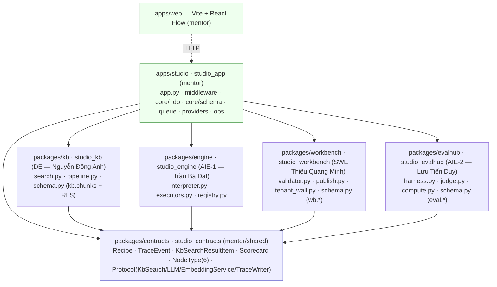
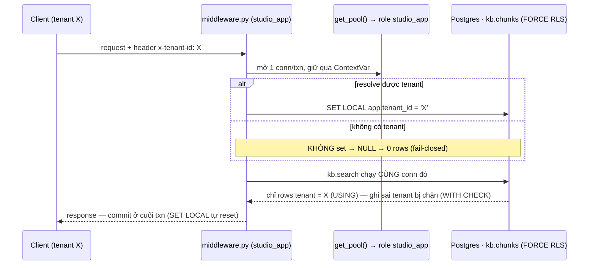
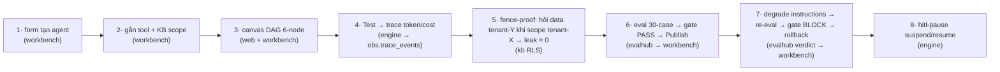

# agentcore-studio-kit

Production-grade `uv` workspace template for **AgentCore Studio** — a Mini-Studio where 4 OJT
engineers (DE · SWE · AIE-1 · AIE-2) build an AI-agent authoring tool end to end: form → tool+KB
(with tenant fence) → 6-node canvas → Test/trace (token+cost) → eval-gate → Publish.

Infra (Docker/Postgres/CI/contracts/RLS/queue/OTel) is WIRE — it runs Day-1. Business logic in the
4 quadrant packages is intentionally TRÔNG (`Protocol` + `NotImplementedError` + a RED acceptance
test = the spec each engineer fills in). See `plans/260717-1516-studio-kit-template/plan.md` for
the full decision record.

## Setup

```bash
make setup    # uv sync — one venv, one lockfile, all 6 Python members resolved
cp .env.example .env   # fill in real DSNs/keys
```

Requires `uv >=0.11` and network access on first `uv sync` (real PyPI deps, no vendoring).

## Dev loop

```bash
make dev        # docker compose up -d (default profile — Postgres, wired in P3/P9)
make test       # uv run pytest — full workspace suite
make lint       # ruff check . && mypy strict (packages + apps) && lint-imports (layers-contract)
```

## Workspace layout

```
packages/
  contracts/   studio_contracts   — frozen pydantic contracts (owner: mentor/shared, mentor-approval)
  kb/          studio_kb          — KB pipeline + kb.search fence-DATA (owner: DE — Nguyễn Đông Anh)
  engine/      studio_engine      — interpreter + 6 node executors (owner: AIE-1 — Trần Bá Đạt, stateless)
  workbench/   studio_workbench   — form+canvas UI wiring, Tenant-Wall (owner: SWE — Thiệu Quang Minh)
  evalhub/     studio_evalhub     — eval harness, judge, scorecard (owner: AIE-2 — Lưu Tiến Duy)
apps/
  studio/      studio_app         — composition root (owner: mentor)
  web/         (Vite/TS, P10)     — NOT a Python workspace member
```

One `uv.lock` at repo root resolves the whole workspace. `uv run --package <name>` isolates a
single member's dep-closure (e.g. `uv sync --package agentcore-studio-kb`).

## Kiến trúc & luồng

### Đồ thị phụ thuộc (import chỉ đi 1 chiều xuống — `.importlinter` cưỡng chế)

`studio_contracts` là **tầng đáy** (chỉ pydantic, không import ai). 4 quadrant package **chỉ** import
`studio_contracts` — KHÔNG import chéo nhau, KHÔNG import `studio_app`. `apps/studio` (composition)
là nơi DUY NHẤT được import mọi thứ, gom 4 xưởng lại thành app chạy được. Xưởng dùng nhau qua
**Protocol (DIP)** ở contracts, do composition tiêm bản thật vào — nên 4 owner làm song song không giẫm chân.



### Hàng rào tenant (RLS) — 1 request đi xuyên fence

Bảng `kb.chunks` bật `FORCE ROW LEVEL SECURITY` + policy `USING(...) WITH CHECK(...)`. App chạy bằng
role **`studio_app`** (non-owner → bị RLS cắn), DDL chạy bằng **`studio_owner`** (pool tách đôi ở
`core/_db.py`). Không set tenant ⇒ `current_setting('app.tenant_id', true)` = NULL ⇒ **0 dòng**
(fail-closed), cho cả đọc lẫn ghi.



### Luồng vòng đời 8 bước (mỗi bước map về package/file sở hữu)



**Mô tả luồng chạy 1 agent:** SWE dựng `Recipe` (bản thiết kế DAG) qua **workbench** → `validator.graph_lint`
kiểm 6-node-đóng/không-chu-trình/tool-whitelist. **engine** `interpreter.run(recipe)` duyệt DAG, mỗi node
gọi executor tương ứng (`kb-retrieve` → gọi `KbSearch` Protocol do **kb** hiện thực, chạy qua hàng rào RLS;
`llm-step` → `LLM` Protocol do **provider** GeminiProvider/FakeLLM cấp), và emit `TraceEvent` mỗi bước →
**PgTraceWriter** ghi 1 INSERT vào `obs.trace_events`. Cuối vòng, **evalhub** `harness.run` chấm 30 golden-case
→ `compute` ra `Scorecard.gate.verdict`; verdict **FAIL** ⇒ **workbench** `publish` chặn + `rollback` version.
Job nền chạy qua queue `core.jobs` (SKIP LOCKED + lease) do **worker/consumer** kéo. Tất cả "nói chuyện" qua
các kiểu ở **contracts** — không package nào import trực tiếp package khác.

> Đồ thị đầy đủ + thiết kế chi tiết (component map, 4-tier ownership, ops/CI): `docs/system-architecture.md`.
> Chuẩn code (ruff/mypy/psycopg/contracts/RLS…): `docs/code-standards.md`.

## Rule of thumb (luật 2-4-8, extended in P10)

The kit is designed around one onboarding rule: **2-4-8** — **2 weeks** to stand the kit up
(mentor, Tuần 0, before Day 1) · **4 owners** each fully self-sufficient in their own package ·
**8-step** demo proves the whole lifecycle end to end. Each OJT engineer lives in **one package**
— DE never edits `packages/workbench`, SWE never edits `packages/kb`, and so on (see the ownership
table below). Editing a package you don't own is a contract change, not a quadrant change, and
needs the mentor-approval rule (see `packages/contracts/`).

- **2** — **weeks to stand up**: this whole kit is designed to be mentor-built in ~2 weeks
  (Tuần 0, before Day 1 batch starts) so trainees `git clone` into a running skeleton on day one.
  Also doubles as: **2** roles per DB connection — `studio_owner` (DDL/admin, bypasses RLS) vs
  `studio_app` (runtime DML, RLS-enforced) — never point runtime traffic at the owner role.
- **4** — **owners**, one per quadrant package, each importing only `studio_contracts` (DIP) — no
  sibling imports, enforced by `.importlinter`'s layers-contract. Ownership table:

  | Owner | Package (import name) | Owns | Contract seam (bút) | Must NOT touch |
  |---|---|---|---|---|
  | **DE — Nguyễn Đông Anh** | `packages/kb` (`studio_kb`) | KB pipeline (doc-factory, chunk/embed/index, fence-DATA `kb.search`, consent-purge), trace sink, cost table, golden-set | trace-event schema · `kb.search` API | Workbench/validator/Tenant-Wall (SWE); interpreter/executor/fence-executor/EmbeddingService (AIE-1); eval harness/judge/scorecard-render (AIE-2) |
  | **SWE — Thiệu Quang Minh** | `packages/workbench` (`studio_workbench`) | Workbench UI (form+canvas wiring), recipe validator/graph-lint, publish/eval-gate wiring, version/rollback, Tenant-Wall (INV-1) | recipe schema | KB pipeline/`kb.search`-filter/trace-sink/golden-set (DE); interpreter/executor/fence-executor (AIE-1); eval-harness/judge/scorecard-render (AIE-2 — SWE only wires the gate that *reads* the verdict) |
  | **AIE-1 — Trần Bá Đạt** | `packages/engine` (`studio_engine`) | Interpreter, 6 node executors, `EmbeddingService` 2-impl, fence-EXECUTOR | consumes `kb.search` + `EmbeddingService` (no contract bút) | Workbench/Tenant-Wall/eval-gate-wiring (SWE); doc-factory/`kb.search`-filter/trace-sink/golden-set (DE — consumes only); eval-harness/judge/scorecard (AIE-2 — supplies citations only) |
  | **AIE-2 — Lưu Tiến Duy** | `packages/evalhub` (`studio_evalhub`) | Eval harness, LLM-judge + agreement-check, scorecard render, trace UX | scorecard format | eval-gate-wiring/publish/rollback (SWE — AIE-2 only supplies the verdict); golden-set (DE — consumes only); interpreter/executor/fence-executor/EmbeddingService (AIE-1 — consumes citations only); Tenant-Wall/INV-1 |

  Full cross-owner boundary detail: `plans/260717-1516-studio-kit-template/research/studio-spec-and-workspace.md`
  §A4. `apps/studio` (composition root, `core.*`+`obs.*` schema) and `apps/web` (Vite/React Flow
  scaffold) are **mentor**-owned — every quadrant package imports `studio_contracts` only, never
  each other or `apps/studio` (DIP, enforced by `.importlinter`).
- **8** — **step Studio lifecycle demo** (money-shot steps in bold): (1) form creates agent ·
  (2) attach 2 tools + 1 KB scope · (3) draw a 6-node-palette canvas DAG · (4) Test → trace
  timeline with live tokens/cost · **(5) fence-proof — ask a Tenant-Y-only question while scoped
  to Tenant-X → refusal + audit, leakage=0** · (6) Eval → scorecard 30-case golden set → gate
  PASS → Publish · **(7) degrade instructions → re-eval → gate BLOCKS publish → rollback** ·
  (8) `hitl-pause` node suspends the run in the playground, resumes after approval. Wired
  progressively through the phases; tied together as one system-level spec in
  `tests/e2e/test_lifecycle.py` (P10, RED-by-design until the 4 quadrants fill their business
  logic).

## How to run

```bash
make setup      # uv sync — one venv, one lockfile, all 6 Python members resolved
make dev        # docker compose up -d (default profile — pgvector, wired in P3/P9)
make test       # uv run pytest — full workspace suite
make leak-test  # RLS/tenant leak-test — has teeth by design (a leaky kb.search stays RED)
make demo       # 8-step lifecycle demo harness (wired in P10 — see tests/e2e/test_lifecycle.py)
make lint       # ruff check . && mypy strict (packages + apps) && lint-imports (layers-contract)
```

`apps/web` (Vite + React Flow, empty scaffold — Decision #11) is a separate Node project, NOT a
Python workspace member:

```bash
cd apps/web
corepack enable pnpm && pnpm install && pnpm build   # or: npm install && npm run build
pnpm dev   # local dev server
```

## CI + branch protection (F16)

GitHub Actions (`.github/workflows/ci.yml`) is the CI **SSOT**; `.gitlab-ci.yml` is a minimal
lint+test mirror only. CI has 4 jobs: `lint`, `test` (per-package matrix), `leak-test`, `build`.

**`leak-test` is red-by-design and must NEVER block a merge.** It exercises the tenant-fence
anti-tamper/closed-set guards before the owning quadrant (DE) ships the real `kb.search` fence —
until that lands, this job is expected to fail. It runs with `continue-on-error: true` so its own
job status never turns the workflow run red, but that is a CI-level guard, not a branch-protection
one: if this repo's GitHub **required status checks** are ever configured as "require branches to
be up to date" + an explicit checks list, add the checks by name (`lint`, `test / *`, `build`) and
deliberately leave `leak-test` OUT of that list. This is a manual repo-settings step (Settings →
Branches → branch protection rule → required status checks) — nothing in this kit automates it,
and no code here substitutes for checking it once the repo exists on GitHub.

## Fallback (Hướng A)

If per-package `uv`/mypy/IDE tooling costs the mentor too much time in week 0, the directory tree
can stay exactly as-is while collapsing to a single root `pyproject.toml` (Hướng A) — the ownership
boundary (packaging + CI-per-package + **per-repo permission** + schema-per-quadrant) still holds
without a true workspace. Not the default; documented here as an explicit escape hatch.

> **Phân phối repo & phân quyền:** kit được tách thành **1 repo cha + 6 submodule** (mỗi domain 1
> repo private, ranh giới quyền cứng ở tầng git). CODEOWNERS đã gỡ. Quy trình đầy đủ: **`GITFLOWS.md`**.
