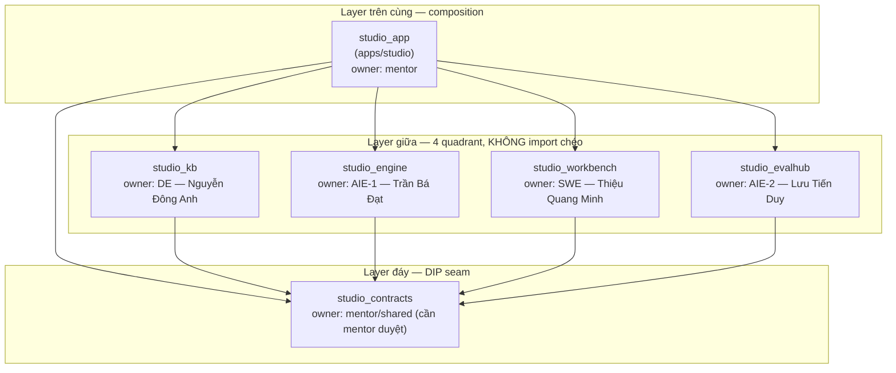
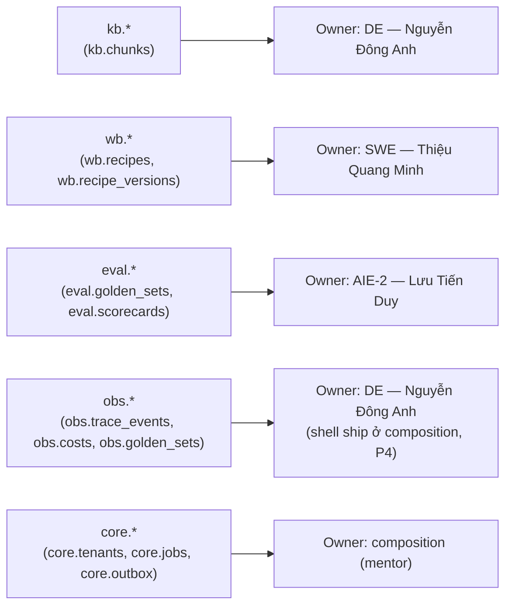
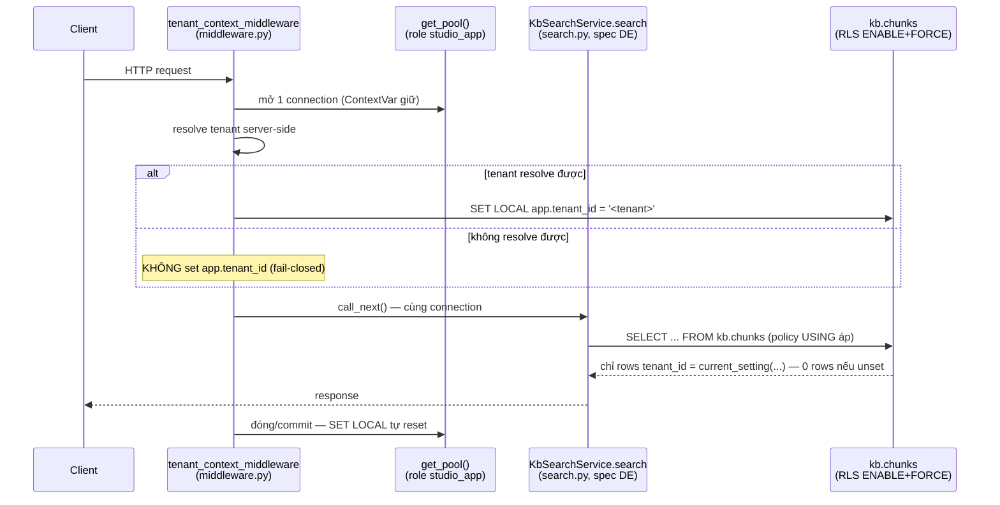
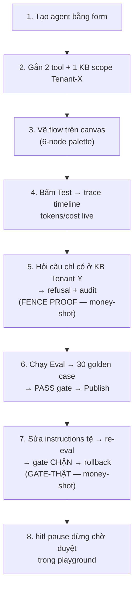

# System Architecture — `agentcore-studio-kit`

> Phạm vi tài liệu: `agentcore-studio-kit/` — uv-workspace modular monolith, template cho 4 kỹ sư OJT
> (DE·SWE·AIE-1·AIE-2) xây **AgentCore Studio**. Mọi claim dưới đây đã đối chiếu trực tiếp với code
> thật trong repo (`agentcore-studio-kit/**`) tại thời điểm viết — không suy diễn từ plan.
> Nguồn kế hoạch: `plans/260717-1516-studio-kit-template/plan.md` + `phases/phase-*.md` (repo root).

## 1. Tổng quan

`agentcore-studio-kit/` là **uv workspace modular monolith** — 1 repo, 1 `uv.lock` gốc, 6 Python
workspace member + 1 frontend Vite/TS member (`apps/web`, loại khỏi workspace Python qua
`[tool.uv.workspace] exclude = ["apps/web"]`, `pyproject.toml:39`). Toàn bộ dữ liệu — DB quan hệ,
vector search, queue, blob — sống trên **1 Postgres** (`pgvector/pgvector:pg17`): không Redis, không
Qdrant, không broker riêng ("Postgres-everything").

Ranh giới cốt lõi của template — **hạ tầng WIRE thật chạy được** đối lập với **business logic 4
quadrant ĐỂ TRỐNG**:

| | Cơ chế |
|---|---|
| **WIRE (chạy Day-1)** | uv workspace + import-linter, 2-role Postgres + pool-split + RLS fence, schema-per-quadrant DDL + `ensure_all_schemas`, queue SKIP LOCKED, outbox, Gemini-LLM provider, `PgTraceWriter`, Docker multi-stage, CI (GH Actions SSOT + GitLab mirror), git-subtree squashed export |
| **ĐỂ TRỐNG (spec 4 owner)** | `KbSearchService.search` + `KbPipeline` (DE — Nguyễn Đông Anh), 6 node-executor + `interpreter.run` (AIE-1 — Trần Bá Đạt), `graph_lint`/`publish`/`rollback`/`resolve_tenant` (SWE — Thiệu Quang Minh), `EvalHarness`/`LLMJudge`/`compute_scorecard` (AIE-2 — Lưu Tiến Duy), `EmbeddingService` 2-impl (AIE-1 — Trần Bá Đạt) |

Mỗi seam "để trống" là **`typing.Protocol` (khai ở `packages/contracts`) + impl thân
`raise NotImplementedError(...)` + test đỏ-by-design** (`pytest.mark.xfail(strict=False)`) — test đỏ
chính là đặc tả hành vi owner phải cài. Xem §6 (DIP/Protocol seams) để biết chính xác file nào WIRED,
file nào EMPTY.

## 2. Dependency graph — import-linter layers-contract

Nguồn: `.importlinter` (root) + xác nhận bằng `grep -rhE "^from studio_|^import studio_" packages apps`
— quadrant package chỉ import được `studio_contracts`; `studio_app` (composition) import được cả 4
quadrant + `studio_contracts`; 4 quadrant **không import chéo nhau, không import `studio_app`**.



`.importlinter` (`[importlinter:contract:layers]`):
```ini
layers =
    studio_app
    studio_kb | studio_engine | studio_workbench | studio_evalhub
    studio_contracts
```
Enforce bằng `uv run lint-imports` (job `lint` trong `.github/workflows/ci.yml` + `.gitlab-ci.yml`).
`apps/web` (Vite/TS) không thuộc graph này — không phải Python member.

### 5 schema Postgres → owner

Schema-per-quadrant là **tầng enforce ownership thứ 4** (cùng packaging/CI/CODEOWNERS) — mỗi
package export `ddl()` riêng, `core/schema.py::ensure_all_schemas()` gom lại lúc boot (direct-import,
không entry-point discovery).



Nguồn: `packages/kb/src/studio_kb/schema.py`, `packages/workbench/src/studio_workbench/schema.py`,
`packages/evalhub/src/studio_evalhub/schema.py`, `apps/studio/src/studio_app/obs/schema.py`,
`apps/studio/src/studio_app/core/schema.py`. `core.schema._QUADRANT_SCHEMA_MODULES` (tuple, sorted
by module name) trực tiếp import 4 module `ddl()` này — đây là "seam antichain" giữ 4 owner làm
song song không đụng file nhau (xem §8).

## 3. Component map

| Package | Import | Distribution (`[project].name`) | Owner | Schema | File cốt lõi (đã verify) |
|---|---|---|---|---|---|
| `packages/contracts` | `studio_contracts` | `agentcore-studio-contracts` | mentor/shared (cần mentor duyệt) | — | `nodes.py` (`NodeType` 6-đóng), `recipe.py` (`Recipe`/`Node`/`Edge`), `trace.py` (`TraceEvent`), `kb.py` (`KbSearchResultItem`+`KbSearch` Protocol), `scorecard.py` (`Scorecard`/`CaseResult`), `protocols.py` (`EmbeddingService`/`LLM`/`TraceWriter`) |
| `packages/kb` | `studio_kb` | `agentcore-studio-kb` | DE — Nguyễn Đông Anh | `kb.*` | `schema.py` (DDL + RLS fence), `search.py` (`KbSearchService`, spec), `pipeline.py` (`KbPipeline` 5-method, spec) |
| `packages/engine` | `studio_engine` | `agentcore-studio-engine` | AIE-1 — Trần Bá Đạt | — (stateless) | `registry.py` (`NodeType`→executor map), `executors.py` (6 executor, spec), `interpreter.py` (`run()`, spec) |
| `packages/workbench` | `studio_workbench` | `agentcore-studio-workbench` | SWE — Thiệu Quang Minh | `wb.*` | `schema.py` (DDL), `validator.py` (`graph_lint`, spec), `publish.py` (`publish`/`rollback`, spec), `tenant_wall.py` (`resolve_tenant`, spec) |
| `packages/evalhub` | `studio_evalhub` | `agentcore-studio-evalhub` | AIE-2 — Lưu Tiến Duy | `eval.*` | `schema.py` (DDL), `harness.py` (`EvalHarness`, spec), `judge.py` (`LLMJudge`, spec), `compute.py` (`compute_scorecard`, spec) |
| `apps/studio` | `studio_app` | `agentcore-studio-app` | mentor (composition) | `core.*` + `obs.*` (shell) | `app.py` (FastAPI factory), `middleware.py` (tenant-context), `core/_db.py` (pool split), `core/schema.py` (`ensure_all_schemas`/`grant_app_privileges`), `core/queue.py`, `core/outbox.py`, `settings.py`, `providers/{gemini,fakes}.py`, `obs/{schema,tracing,trace_writer}.py`, `worker/consumer.py` |
| `apps/web` | — (Vite/TS) | — | mentor (SWE — Thiệu Quang Minh nở UX sau) | — | `src/App.tsx` (React Flow canvas rỗng), `src/main.tsx` |

`evalhub` (không phải `eval`) để tránh shadow builtin Python — comment trong
`packages/evalhub/pyproject.toml` xác nhận đúng lý do này.

**py.typed**: `packages/{contracts,kb,workbench,evalhub}/src/studio_*/py.typed` có mặt (verify bằng
`find`) — cho phép cross-package import được mypy strict type-check không cần `ignore`. `studio_engine`
và `studio_app` KHÔNG có `py.typed` trong cây hiện tại.

## 4. RLS fence — cơ chế chi tiết (crown jewel)

Fence chống rò rỉ chéo-tenant trên `kb.chunks` dựng từ **4 lớp cơ chế phối hợp**, không lớp nào một
mình là đủ (docstring `packages/kb/src/studio_kb/schema.py:1-14` giải thích trực tiếp):

### 4.1. Hai role Postgres (`docker/postgres-init/00-roles.sql`)

- `studio_owner` — `NOSUPERUSER NOCREATEDB NOCREATEROLE`, **owner của mọi schema/table** kit này tạo
  (qua `get_admin_pool()`). Vì là *owner*, `FORCE ROW LEVEL SECURITY` mới "cắn" được chính nó — theo
  mặc định Postgres, chủ sở hữu bảng bypass RLS trừ khi bảng đó `FORCE ROW LEVEL SECURITY`.
- `studio_app` — `NOSUPERUSER NOCREATEDB NOCREATEROLE`, **non-owner**, chỉ nhận quyền DML qua GRANT
  tập trung (§4.4). Không có quyền `CREATE ON DATABASE`.
- Cả 2 role đều `NOSUPERUSER` — không role nào bypass RLS qua đặc quyền superuser.
- `01-extensions.sql` chạy `CREATE EXTENSION IF NOT EXISTS vector` bằng superuser `postgres` —
  **không** nằm trong bất kỳ `ddl()` nào (cả `studio_owner` lẫn `studio_app` đều không đủ quyền tạo
  extension).

### 4.2. Pool split (`apps/studio/src/studio_app/core/_db.py`)

- `get_admin_pool()` — DSN `STUDIO_DATABASE_URL_ADMIN`, role `studio_owner`. **Chỉ** dùng cho
  `ensure_all_schemas()` + `grant_app_privileges()` lúc boot (lifespan trong `app.py`).
- `get_pool()` — DSN `STUDIO_DATABASE_URL`, role `studio_app`. Pool duy nhất mà request path
  (middleware, `KbSearchService`) dùng — **đây là pool duy nhất RLS thực sự áp dụng**, vì
  `studio_app` không phải owner của bảng.
- Cả 2 pool là lazy singleton (`asyncio.Lock` guard), không bao giờ trộn lẫn — docstring module ghi
  rõ: "Never call `ensure_all_schemas`/`grant_app_privileges` against `get_pool()`, and never run
  request-path queries against `get_admin_pool()`".

### 4.3. Policy `USING ... WITH CHECK ...` trên `kb.chunks` (`packages/kb/src/studio_kb/schema.py`)

```sql
ALTER TABLE kb.chunks ENABLE ROW LEVEL SECURITY;
ALTER TABLE kb.chunks FORCE ROW LEVEL SECURITY;

CREATE POLICY kb_chunks_tenant_isolation ON kb.chunks
    USING (tenant_id = current_setting('app.tenant_id', true))
    WITH CHECK (tenant_id = current_setting('app.tenant_id', true));
```
- `USING` chặn **đọc** cross-tenant; `WITH CHECK` chặn **ghi** cross-tenant (2 vế, không chỉ 1).
- `current_setting('app.tenant_id', true)` — tham số `true` khiến setting chưa set trả về `NULL`
  thay vì raise; `tenant_id = NULL` không bao giờ đúng trong SQL 3-valued logic → **session không set
  tenant → 0 rows** (fail-closed, không phải "trả hết").
- `FORCE ROW LEVEL SECURITY` khiến policy áp cả lên `studio_owner` (dù connect bằng owner cũng chỉ
  thấy đúng phạm vi — không phải điều kiện vận hành bình thường, nhưng đóng lỗ hổng "owner bypass").

### 4.4. GRANT tập trung (`apps/studio/src/studio_app/core/schema.py::grant_app_privileges`)

Một hàm duy nhất, gọi ngay sau `ensure_all_schemas()`, cấp `GRANT USAGE` + `GRANT SELECT, INSERT,
UPDATE, DELETE` + `ALTER DEFAULT PRIVILEGES FOR ROLE studio_owner` trên cả 5 schema
(`kb, wb, obs, eval, core`) cho `studio_app` — tránh rải GRANT theo 4 owner riêng lẻ (bài học
document-intake từ bỏ schema-per-module vì pain multi-schema).

### 4.5. Middleware — 1 conn/txn per request qua ContextVar (`apps/studio/src/studio_app/middleware.py`)

- Mỗi HTTP request mở **1 connection từ `get_pool()`**, giữ qua `ContextVar` (`_request_conn`) suốt
  vòng đời request.
- Resolve tenant server-side (`_resolve_tenant_id` — P3 stub đọc header, thay bằng session/JWT thật
  sau); nếu không resolve được → **không set `app.tenant_id`** (fail-closed mặc định).
- Nếu resolve được → `SET LOCAL app.tenant_id = <literal>` (dùng `sql.Literal`, không phải bind
  parameter — `SET LOCAL` là utility statement không nhận bind qua wire protocol). `SET LOCAL` chỉ
  có hiệu lực trong transaction hiện tại — tự động reset khi transaction kết thúc, nên connection trả
  về pool không mang theo tenant setting cũ sang request sau (chống leak qua pool reuse).

### 4.6. Sequence — 1 request qua fence



### 4.7. Test chứng minh (money-shot)

`packages/kb/tests/test_rls_framework.py` (XANH, không red-by-design): `test_no_tenant_zero_rows`
(app-conn không set tenant → `count(*) = 0`), `test_tenant_scoped_visibility` (2-conn dance: seed
qua `admin_pool`, assert qua `pool`), `test_force_rls_and_with_check`. Đối lập:
`packages/kb/tests/test_leak.py` — leak-test **CÓ RĂNG** (seed 2 tenant thật, assert loại trừ
cross-tenant qua đường app — `KbSearchService`), marked `xfail(strict=False)` vì `search()` hiện
`raise NotImplementedError`; `test_leak_meta.py` là anti-tamper (grep source `test_leak.py` còn đủ
assertion T1+T6, chặn ai đó làm rỗng test để giả xanh).

## 5. Runtime flow — vòng đời 8 bước

Nguồn hành vi: `research/studio-spec-and-workspace.md` §A5 (bảng 8-bước, trong
`plans/260717-1516-studio-kit-template/` ở repo root) — cột "file sở hữu" dưới đây là bằng chứng
verify trực tiếp từ code hiện có (WIRE) hoặc seam-spec (ĐỂ TRỐNG).



| Bước | Package / file sở hữu | Trạng thái |
|---|---|---|
| 1–2 | `packages/workbench` (`schema.py::wb.recipes`, spec `validator.py`) + `packages/contracts/recipe.py` (`Recipe`/`KbBinding`) | DDL wire; validator spec |
| 3 | `apps/web/src/App.tsx` (React Flow canvas rỗng) + `packages/contracts/nodes.py` (`NodeType` 6-đóng) | scaffold wire; canvas UX spec (SWE nở sau) |
| 4 | `packages/engine/interpreter.py::run()` (spec) dispatch qua `registry.py`; trace ghi bằng `apps/studio/src/studio_app/obs/trace_writer.py::PgTraceWriter` (wire, 1 INSERT thuần) | interpreter spec; trace-sink wire |
| 5 | `packages/kb/schema.py` (RLS fence, wire) + `packages/kb/search.py::KbSearchService` (spec) + `packages/engine/executors.py::KbRetrieveExecutor` (fence-EXECUTOR, spec) | fence wire; retrieval logic spec |
| 6 | `packages/evalhub/{harness,judge,compute}.py` (spec) → `packages/workbench/publish.py::publish()` (spec, đọc `scorecard.gate.verdict`) | toàn spec (AIE-2 + SWE wiring) |
| 7 | `packages/evalhub/compute.py` (verdict FAIL, spec) → `packages/workbench/publish.py::rollback()` (spec, đọc `wb.recipe_versions`) | toàn spec |
| 8 | `packages/engine/executors.py::HitlPauseExecutor` (spec) | spec |

`tests/e2e/test_lifecycle.py` (root của kit) là placeholder đỏ-by-design ties toàn bộ 8 bước — không
chặn merge (CI job riêng/skip), chờ 4 quadrant fill logic thật.

## 6. DIP / Protocol seams — ranh giới WIRED vs ĐỂ TRỐNG

4 Protocol khai ở `packages/contracts` (bottom layer, `@runtime_checkable typing.Protocol`, KHÔNG
thân hàm):

| Protocol | File | Impl WIRED | Impl ĐỂ TRỐNG (spec owner) |
|---|---|---|---|
| `LLM` | `protocols.py` | `providers/gemini.py::GeminiProvider` (chỉ `complete`, opt-in qua `STUDIO_USE_FAKE_PROVIDERS=false`+key) + `providers/fakes.py::FakeLLM` (CI-fixture, hash-seeded deterministic) | — |
| `EmbeddingService` | `protocols.py` | `providers/fakes.py::FakeEmbedding` (**CHỈ CI-fixture** — docstring ghi rõ "KHÔNG phải deliverable AIE-1") | Concrete 2-impl (stub-local + gateway) — deliverable graded AIE-1, **không ship trong kit** |
| `TraceWriter` | `protocols.py` | `obs/trace_writer.py::PgTraceWriter` (1 INSERT thuần vào `obs.trace_events`, cấm cost-aggregation/dedup trong `write()`) | — |
| `KbSearch` | `kb.py` | — (chỉ seam) | `packages/kb/search.py::KbSearchService.search` — thân `raise NotImplementedError` (spec DE) |

Composition (`apps/studio`) là nơi duy nhất inject concrete impl vào Protocol — quadrant package
không bao giờ import concrete class của package khác (chỉ `studio_contracts`). Không dùng DI-framework
(không container 3-tầng như AgentSpace anti-pattern) — **direct composition thuần** tại `app.py`/
providers selector.

Danh sách đầy đủ seam ĐỂ TRỐNG khác (không phải Protocol từ contracts, nhưng cùng nguyên tắc
"thân `NotImplementedError` = spec"):
- `packages/kb/pipeline.py::KbPipeline` — 5 method (`chunker`/`embed_invoke`/`index`/`consent_purge`/`re_index`), spec DE.
- `packages/engine/executors.py` — 6 class (`KbRetrieveExecutor`…`EndExecutor`) + `interpreter.py::run()`, spec AIE-1.
- `packages/workbench/validator.py::graph_lint`, `publish.py::publish/rollback`, `tenant_wall.py::resolve_tenant` — spec SWE.
- `packages/evalhub/harness.py::EvalHarness`, `judge.py::LLMJudge`, `compute.py::compute_scorecard` — spec AIE-2.

## 7. Ops / delivery (tóm tắt)

- **Dockerfile** — 2 stage: `builder` (`python:3.14-slim` + `uv` toolchain copy từ
  `ghcr.io/astral-sh/uv`) copy **tất cả** pyproject của mọi member trước (`uv sync --frozen
  --no-install-project`, cache layer), rồi copy source + `uv sync --frozen --no-editable` (bắt buộc
  `--no-editable` — runtime stage không giữ source, editable-path sẽ trỏ vào nơi không tồn tại);
  `runtime` (slim, chỉ copy `.venv` từ builder, không toolchain).
- **`docker-compose.yml`** — 3 profile: default (`postgres`, image `pgvector/pgvector:pg17`, mount
  `docker/postgres-init/`); `app` (build `.`, port 8000); `obs` (Langfuse self-host cluster —
  redis/clickhouse/minio **chỉ phục vụ Langfuse**, dữ liệu của kit vẫn 100% Postgres).
  `docker-compose.test.yml` (project riêng `studio-test`, port 5433) là stack test cô lập, tách biệt
  khỏi stack dev.
- **CI** — `.github/workflows/ci.yml` là **SSOT**: job `lint` (ruff+mypy+lint-imports), `test`
  (matrix per-package qua `uv run --package <x> pytest`), `leak-test` (**`continue-on-error: true`**
  — không chặn merge, chạy riêng `packages/kb/tests/test_leak.py`), `build` (docker build smoke).
  `.gitlab-ci.yml` là mirror tối thiểu (chỉ `lint`+`test`, không leak-test/build — tránh 2-forge
  drift, comment trong file ghi rõ lý do kỹ thuật: GitLab `services:` không bind-mount được
  init-script).
- **Phân phối = multi-repo submodule** (thay cho subtree-squash-1-repo cũ): repo cha
  `agentcore-studio-kit` giữ root config + `apps/web`, còn `packages/{contracts,kb,engine,workbench,
  evalhub}` + `apps/studio` là **6 submodule repo riêng** (private, mỗi owner 1 repo → ranh giới quyền
  CỨNG ở tầng git, chạy được trên GitHub-private-Free nơi branch-protection bị khoá). Team OJT
  `git clone --recursive` repo cha rồi `git submodule update --init --recursive`. `.pre-commit-config.yaml`
  giữ hook `nda-denylist` (`scripts/nda-denylist.sh`) chặn file mentor/rubric commit vào bất kỳ repo nào.
  **Quy trình đầy đủ (phân quyền + thao tác + pitfalls): `GITFLOWS.md`.**

## 8. Ownership enforcement — 4 tầng

| Tầng | Cơ chế | Bằng chứng |
|---|---|---|
| 1. Packaging | Mỗi quadrant là 1 uv workspace member, `[project].name` riêng, dependency riêng | `packages/*/pyproject.toml` (5 file) + `pyproject.toml` root `[tool.uv.workspace]` |
| 2. CI-per-package | Matrix job `test` chạy `uv run --package <name> pytest <path>` từng package riêng | `.github/workflows/ci.yml` job `test.strategy.matrix` |
| 3. Per-repo permission (multi-repo) | Mỗi domain là 1 submodule-repo riêng; owner có **write**, người khác chỉ **read** → ranh giới CỨNG ở tầng git (không phải soft review như CODEOWNERS cũ). Contracts = mentor-approval. | `.gitmodules` (6 submodule) + collaborator-permission mỗi repo; chi tiết `GITFLOWS.md` §2 |
| 4. Schema-per-quadrant | Mỗi quadrant `ddl()` riêng, không copy-paste DDL tập trung; `ensure_all_schemas()` direct-import (P5–P8 chỉ điền thân `ddl()` trong package mình, không đụng `apps/studio`) | `core/schema.py::_QUADRANT_SCHEMA_MODULES` |

"Seam antichain" giữ 4 owner làm song song không đụng file: class/`ddl()` stub đã tồn tại từ P1, mỗi
owner chỉ điền thân trong `packages/<mình>/{src,tests}/**`; runtime dependency khai đủ ngay từ P1 nên
P5–P8 không cần sửa `pyproject.toml`/`uv.lock` (relock chỉ 1 lần ở phase tích hợp).
