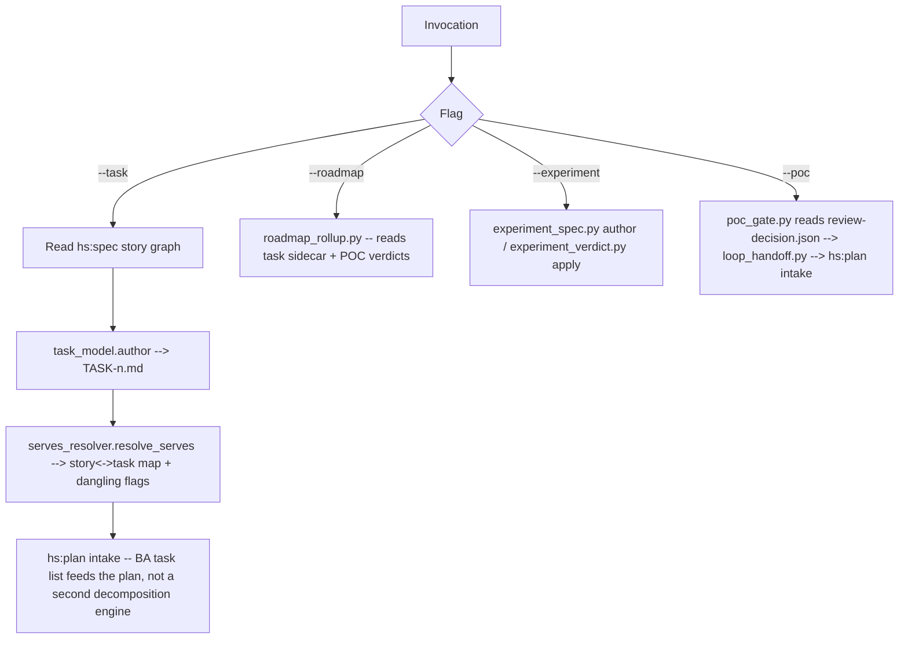

# hs:shape — BA bridge from PO spec to dev tasks

BA-facing skill bridging `hs:spec`'s PO story spec to the dev/test loop — never facing the
market. `hs:shape` reads the PO story graph; every write lands in its own BA sidecar under
`docs/product/shape/` — never mutates a PO artifact.

`hs:shape` is the BA half of the product pair — `hs:spec` (PO) owns the market-facing Vision→Story
hierarchy; `hs:shape` turns approved story→work (tasks), work→schedule (roadmap+effort),
pre-registers/reads a market hypothesis (experiment), and closes the technical-feasibility loop
(POC) at tầng-1 before anything counts as "roadmapped."

## When to Use

- Story approved, needs decomposing into concrete dev tasks (`--task`).
- Tasks/milestones need rolling up into a roadmap with an effort figure (`--roadmap`).
- Hypothesis needs pre-registering before an experiment runs, or its result needs applying
  against the pre-registered decision rule (`--experiment`).
- Technical POC needs to close through `hs:cook`/`hs:test`/`hs:code-review` before roadmap
  rollup treats it as a precondition met (`--poc`).

## Flags

| Flag | Purpose |
|---|---|
| `--task [story\|epic\|prd]` | Decompose into dev-task sidecar record(s); `serves:[story_ids]` supports 1-1/1-n/n-1 with no schema special-case. A story id authors directly; an epic/prd id is a *selector* fanning out to descendant stories — see the Task selector note below. See `references/task-model.md`, `references/story-task-spec.md`. |
| `--roadmap` | Roll milestones + BA effort figures up from the task sidecar (POC verdict is a precondition — a milestone cannot roll up work whose feasibility hasn't closed). See `references/roadmap-effort.md`. |
| `--experiment` | Author a market-experiment spec (hypothesis/design/decision_rule) before anything runs, or apply a PO-supplied result against its own decision rule ("kẹp 2 đầu" — clamp both ends). See `references/experiment-spec.md`. |
| `--poc` | Close the technical POC-gate loop: read `hs:code-review`'s `review-decision.json`, carry the plan id forward, and hand a POC-id-bearing brief to `hs:plan` intake. See `references/poc-gate-loop.md`, `references/ba-to-plan-intake.md`. |

## Task selector (`--task` with an epic/prd id)

`--task` accepts a story id (authored directly, as before) OR an epic/prd id used as a
**selector** that fans out to the descendant stories. The container is only a picker: every
authored task's `serves` still points at a STORY, never at the epic/prd.

For an epic/prd target:

1. **Scope-preflight (read-only).** `scripts/descendant_resolver.py` resolves the descendant
   stories and classifies each as approved / draft / already-has-task. It only reads the PO
   graph — it never writes.
2. **Empty branch → HARD STOP.** If there is no descendant story (an epic with no stories, or a
   prd with no story under any child epic), do NOT author anything: report the stop and route
   the user to `hs:spec --story <id>` — `hs:shape` cannot create a PO story (the PO tree is
   read-only from here).
3. **Interview (ask, don't assume).** Otherwise ask how far to go — approved-only or
   include-draft — via AskUserQuestion. Keep this ask in the MAIN session; a subagent has no TTY
   to interview through.
4. **Author.** `scripts/task_selector.py`'s `author_tasks_for_selector(root, target_id,
   include_draft)` authors one task per chosen story (each `serves:[story_id]`). A task authored
   off a not-yet-approved story is marked `from_draft: true` (a warning marker only; `serves` is
   unchanged). Approved-only mode reports the draft stories it skipped.

Full flow, including the boundary rules, is in `references/story-task-spec.md`.

## Output Contract (in the user's project)

All BA artifacts live under sidecar `docs/product/shape/` — owned exclusively by this skill,
disjoint from `hs:spec`'s `docs/product/{vision,brd,prds,epics,stories,...}`.

```
docs/product/shape/
├── tasks/TASK-<n>.md          # dev-task sidecar: serves:[story_ids], 1-1/1-n/n-1
├── roadmap.md                 # milestone + effort rollup sidecar (single file, rewritten whole)
├── experiments/EXP-<n>.md     # market-experiment spec + verdict (author + read only)
└── poc/                       # POC-gate sidecar (review-decision.json linkage)
```

Every script-driven write resolves through `scripts/shape_paths.py`'s `shape_path()` — this
skill's canonical containment helper. It raises on any escape attempt (`..`/absolute/symlink)
aimed at `docs/product/stories/` or elsewhere under the PO-owned `docs/product/` tree: `hs:shape`
never mutates a PO story. Enforcement code, exercised by `harness/tests/test_shape_task_serves.py`,
not a prose-only convention.

## Workflow Map



## Loads `references/*` on Demand

- `references/task-model.md` — dev-task frontmatter model, 3-cardinality table (1-1/1-n/n-1),
  write-containment invariant.
- `references/story-task-spec.md` — end-to-end BA decompose→resolve→hand-off flow, incl.
  non-goals (never mutates a story, never assigns story points, never reinvents `hs:plan`'s
  phase-graph machinery) + boundary with `hs:spec`'s `strict_gate.py`.
- `references/roadmap-effort.md` — milestone + effort rollup model.
- `references/experiment-spec.md` — market-experiment author/verdict pair, "kẹp 2 đầu" (clamp
  both ends) boundary, why the harness never runs an experiment itself.
- `references/poc-gate-loop.md`, `references/ba-to-plan-intake.md` — technical POC-gate loop +
  the plan-intake brief it produces.

Load only the reference relevant to the active flag.

## Resources

- `scripts/shape_paths.py` — canonical script-path containment helper (`shape_path()`). Every
  other hs:shape writer resolves its target through this before touching disk; none writes into
  the PO tree.
- `scripts/task_model.py` — dev-task CRUD: allocate `TASK-<n>` (parent-free monotonic — n-1
  cannot be story-scoped), validate `serves` non-empty, write via `shape_path()`.
- `scripts/serves_resolver.py` — resolves `serves:[story_ids]` against `hs:spec`'s story graph
  (isolated load of `spec_graph.build_graph`, mirroring the sibling experiment sidecar's
  pattern); flags a `serves` id absent from the graph as dangling, not rejected.
- `scripts/descendant_resolver.py` — read-only: resolves an epic/prd selector id to its
  descendant stories (status + has_task), used by the `--task` scope-preflight. Only type-story
  nodes count; empty branch = defined by story count.
- `scripts/task_selector.py` — composes the resolver (read) with `task_model.author` (write) to
  fan an epic/prd selector out to one task per chosen story; empty branch routes to `hs:spec`,
  never authored.
- `scripts/experiment_spec.py`, `scripts/experiment_verdict.py` — author a market-experiment spec
  before anything runs; apply a PO-supplied result to the spec's own decision rule after. Neither
  script fetches, polls, or subprocesses anything.
- `schemas/task.schema.json`, `schemas/experiment.schema.json` — frontmatter backing.

## Operating Principles

- **Read the PO graph, never write the PO tree.** `hs:shape` consumes `hs:spec`'s
  `spec_graph.build_graph()` output; `docs/product/stories/` (and the rest of
  `docs/product/{vision,brd,prds,epics}`) is read-only from this skill's side, enforced by
  `shape_path()`, not just documented.
- **No cardinality special-case.** `serves:[story_ids]` is one field; 1-1/1-n/n-1 all fall out
  of how it is populated, not a `mapping_type` enum.
- **Kẹp 2 đầu, never the middle.** For an experiment, this skill authors the
  pre-registered spec and reads a PO-supplied verdict. It never solicits customers, runs an
  A/B split, or polls anything — running an experiment is market territory the PO owns outside
  the harness.
- **POC ≠ experiment.** Technical feasibility (does the thing work) closes at tầng-1 through
  `hs:cook`→`hs:test`→`hs:code-review`, already-closed gates this skill only reads the verdict
  of. Market validation (will customers want it/pay for it) is the PO's territory, clamped by
  `--experiment`'s two ends. Conflating the two would smuggle market judgment into a technical
  gate or vice versa.
- **Hand off, don't reinvent.** The BA task list feeds `hs:plan` intake; this skill does not
  build a second phase-planning engine.

Deeper operating guidance lives in `references/` (loaded on demand by flag).
