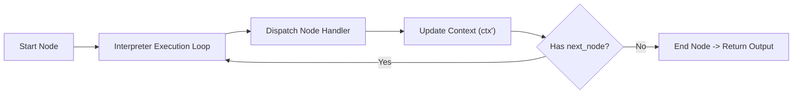

# 📖 BÀI GIẢNG CHI TIẾT DAY 01 — AIE-1: INTERPRETER ENGINE & 6 CLOSED NODE TYPES

> **Vị trí phụ trách**: AI Engineer 1 (AIE-1 — Trần Bá Đạt)  
> **Chủ đề chính**: Động cơ thực thi lõi Interpreter, Vòng lặp duyệt DAG (Execution Loop), 6 Node Types đóng, và EmbeddingService Protocol  
> **Mục tiêu**: Nắm vững kiến trúc phần lõi thực thi Agent (`packages/engine`) để chuẩn bị xây dựng Interpreter loop không lưu trạng thái (Stateless).

---

## 🏛️ 1. KIẾN TRÚC ENGINE INTERPRETER EXECUTION LOOP

**Studio Engine** đóng vai trò là "bộ não thực thi" của AgentCore Studio, nhận đầu vào là cấu hình file Recipe DAG từ Workbench và tiến hành duyệt từng Node theo thứ tự.

### Nguyên lý Stateless Execution (Không lưu trạng thái):
- Engine **không tự lưu state** của Agent trong bộ nhớ RAM toàn cục giữa các lệnh gọi.
- Mỗi bước thực thi nhận vào một **Execution Context (`ctx`)** và trả về một **Context sửa đổi (`ctx'`)**:

```text
execute(node, ctx) -> ctx'
```



---

## 📦 2. DANH SÁCH 6 LOẠI NODE ĐÓNG (CLOSED NODE TYPES)

Để bảo đảm tính an toàn và khả năng kiểm thử, Engine của AgentCore Studio quy định **nghiêm cấm thêm các loại node tùy tiện**. Tất cả đồ thị Agent chỉ được tạo thành từ **6 loại Node đóng**:

| Tên Node Type | Chức năng thực thi | Input / Output |
|---|---|---|
| 1. `kb-retrieve` | Truy xuất tri thức Callisto qua hàm `kb.search` của DE | Input: query, tenant $\rightarrow$ Output: chunks |
| 2. `llm-step` | Gọi dịch vụ LLM sinh câu trả lời | Input: prompt, context, system_prompt $\rightarrow$ Output: response_text |
| 3. `condition` | Rẽ nhánh logic dựa trên điều kiện | Input: expression $\rightarrow$ Output: Next Node ID (true/false) |
| 4. `tool-call` | Thực thi một công cụ ngoài (Python Tool) | Input: tool_name, args $\rightarrow$ Output: tool_result |
| 5. `hitl-pause` | Tạm dừng luồng chờ con người duyệt (Human-in-the-Loop) | Input: checkpoint state $\rightarrow$ Status: PAUSED |
| 6. `end` | Kết thúc hành trình thực thi của Agent | Input: final context $\rightarrow$ Output: Final Result |

👉 **Cảnh báo**: Nếu Recipe chứa một node type không nằm trong 6 loại trên (ví dụ `custom-script`), Engine phải lập tức từ chối thực thi và bắn lỗi `UnsupportedNodeTypeError`.

---

## 🧠 3. EMBEDDING SERVICE PROTOCOL

Trong mảng AIE-1, bạn cũng phụ trách thiết kế `EmbeddingService Protocol` quy định giao diện sinh vector nhúng chuẩn:

```python
class EmbeddingServiceProtocol(Protocol):
    async def embed_query(self, text: str) -> list[float]:
        """Sinh vector nhúng cho một câu hỏi."""
        ...

    async def embed_documents(self, texts: list[str]) -> list[list[float]]:
        """Sinh vector nhúng cho danh sách tài liệu."""
        ...
```
