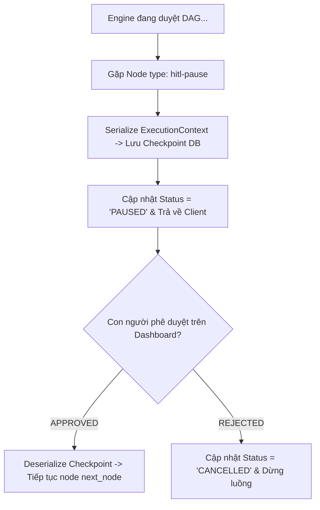

# 📖 BÀI GIẢNG CHI TIẾT DAY 05 — AIE-1: HITL PAUSE-RESUME & CHECKPOINT STATE MACHINE

> **Vị trí phụ trách**: AI Engineer 1 (AIE-1 — Trần Bá Đạt)  
> **Chủ đề chính**: Điểm tạm dừng chờ con người duyệt HITL-Pause, Checkpoint State Serialization, và Streaming Trace Timeline  
> **Mục tiêu**: Xây dựng tính năng kiểm soát hành vi Agent an toàn (Human-in-the-Loop), cho phép tạm dừng luồng chạy ở các bước nhạy cảm và tiếp tục chạy khi nhận phê duyệt từ con người.

---

## ⏸️ 1. CƠ CHẾ HITL-PAUSE VÀ CHECKPOINT STATE MACHINE

Trong các hệ thống AI Agent thực tế, một số hành động có tính rủi ro cao (ví dụ: thực hiện giao dịch tài chính, gửi email cho hàng loạt khách hàng) **bắt buộc phải được con người phê duyệt** trước khi thực thi.



### Thiết kế Node Executor `hitl-pause` (`hitl_executor.py`):
```python
class HitlPauseExecutor(BaseNodeExecutor):
    async def execute(self, node: RecipeNode, ctx: ExecutionContext) -> ExecutionContext:
        # 1. Đánh dấu trạng thái TẠM DỪNG
        ctx.status = "PAUSED"
        ctx.variables["pause_node_id"] = node.id
        ctx.variables["approval_required"] = node.params.get("message", "Chờ con người phê duyệt")
        
        # 2. Serialize toàn bộ ExecutionContext thành JSON
        checkpoint_data = ctx.model_dump_json()
        
        # 3. Lưu vào bảng checkpoints DB
        await save_checkpoint(session_id=ctx.session_id, data=checkpoint_data)
        
        return ctx
```

---

## ▶️ 2. QUY TRÌNH RESUME EXECUTION TỪ CHECKPOINT

Khi quản trị viên nhấn nút "Approve" trên Dashboard của SWE:
1. Workbench gửi Yêu cầu Resume kèm `session_id` sang Engine: `POST /api/engine/resume`.
2. Engine đọc dữ liệu Checkpoint JSON từ DB: `checkpoint_data = load_checkpoint(session_id)`.
3. Khôi phục lại đối tượng Pydantic `ExecutionContext.model_validate_json(checkpoint_data)`.
4. Cập nhật `ctx.status = "RUNNING"`.
5. Tiếp tục kích hoạt vòng lặp `Interpreter.run(ctx)` bắt đầu từ `node.next_node`.

### Cạm bẫy thiết kế:
- **Cấm Polling / Block Thread**: Không sử dụng vòng lặp chờ `while True:` hoặc `time.sleep()` trong Server process để chờ con người bấm nút Approve. Hành vi đó sẽ làm treo cứng server.
- **Giải pháp chuẩn**: Giải phóng tiến trình (Stateless release thread). Đợi webhook/API trigger mới load lại Checkpoint từ DB.
