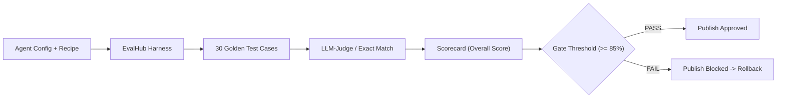

# 📖 BÀI GIẢNG CHI TIẾT DAY 01 — AIE-2: EVALUATION HARNESS & EVAL-GATE MECHANISM

> **Vị trí phụ trách**: AI Engineer 2 (AIE-2 — Lưu Tiến Duy)  
> **Chủ đề chính**: Hệ thống Evaluation Harness, Cơ chế Cổng Đánh giá Eval-Gate, Bảng điểm Scorecard Format, và Trace Playground  
> **Mục tiêu**: Nắm vững lý thuyết đo lường chất lượng Agent để chuẩn bị thiết kế Hợp đồng Scorecard (Contract #4) ở Day 02.

---

## 🏛️ 1. TỔNG QUAN HỆ THỐNG EVALUATION HARNESS VÀ EVAL-GATE

Trong vòng đời 8 bước của AgentCore Studio, **AIE-2 sở hữu gói `packages/evalhub`** — nơi tự động kiểm tra và chấm điểm sản phẩm Agent trước khi cho phép người dùng bấm nút Publish.

### Luồng kiểm định chất lượng (Eval-Gate Wiring):

---

## 📊 2. CẤU TRÚC SCORECARD FORMAT (CONTRACT #4 CONCEPT)

Bảng điểm **Scorecard** là kết quả đầu ra chính của `evalhub`, bao gồm 4 nhóm chỉ số cơ bản:

1. **Exact Match Accuracy**: Tỷ lệ câu trả lời khớp chính xác với nhãn chuẩn (Golden Label).
2. **Citation Accuracy**: Độ chính xác của các đoạn trích dẫn Callisto chunk (ngăn ảo giác).
3. **LLM-Judge Agreement**: Mức độ đồng thuận của mô hình chấm điểm độc lập GPT-4o với đáp án chuẩn.
4. **Latency & Cost Overhead**: Thời gian chạy trung bình và tổng chi phí tiêu tốn trong đợt test.

---

## 🔬 3. TRACE PLAYGROUND CONCEPTS

Nền tảng **Trace Playground** hỗ trợ kỹ sư AI soi chi tiết vết thực thi của Agent từng bước một:
- Xem danh sách câu hỏi trong bộ test.
- So sánh câu trả lời thực tế của Agent (`actual_output`) với đáp án mẫu (`expected_output`).
- Phân tích nguyên nhân tại sao một câu kiểm thử bị đánh dấu FAILED (lỗi rò rỉ tenant, sai trích dẫn, hoặc LLM không tuân thủ prompt).
