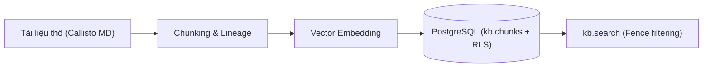

# 📖 BÀI GIẢNG CHI TIẾT DAY 01 — DE: KB PIPELINE & DATA SECURITY FENCE

> **Vị trí phụ trách**: Data Engineer (DE — Nguyễn Đông Anh)  
> **Chủ đề chính**: Kiến trúc KB Pipeline, PostgreSQL Row Level Security (RLS), Lineage Chunking, và Trace Event Sink  
> **Mục tiêu**: Nắm vững lý thuyết hạ tầng dữ liệu của AgentCore Studio để chuẩn bị thiết kế Hợp đồng Schema ở Day 02.

---

## 🏛️ 1. TỔNG QUAN KIẾN TRÚC KB PIPELINE TRONG AGENTCORE STUDIO

Hệ thống Knowledge Base (KB) trong AgentCore Studio đóng vai trò là "bộ nhớ tri thức" giúp AI Agent truy vết thông tin chính xác từ tài liệu doanh nghiệp mà không bị ảo giác (hallucination).

### Luồng xử lý dữ liệu (Data Pipeline Flow):


1. **Ingestion & Parsing**: Tiếp nhận tài liệu Markdown chứa YAML Frontmatter (quy định `tenant_id`, `section_role`, `doc_id`).
2. **Deterministic Chunking**: Chia cắt tài liệu thành từng đoạn nhỏ dựa trên cấu trúc header, gán mã định danh duy nhất không ngẫu nhiên: `chunk_id = {doc_id}#c{n}`.
3. **Embedding**: Tạo vector biểu diễn ngữ nghĩa cho từng đoạn chunk.
4. **Index & Security Fencing**: Lưu trữ vào PostgreSQL bảng `kb.chunks` có bật cơ chế **Row Level Security (RLS)** để ngăn ngừa việc truy cập chéo dữ liệu giữa các tenant.

---

## 🔒 2. CHUYÊN SÂU: POSTGRESQL ROW LEVEL SECURITY (RLS) FENCE

Trong mô hình Multi-Tenant (nhiều khách hàng chung 1 hạ tầng), nguy cơ lớn nhất là **Data Leakage** (rò rỉ dữ liệu của khách hàng này sang khách hàng khác).

### Tại sao không dùng `WHERE tenant_id = ...` đơn thuần ở tầng Application?
Nếu chỉ cậy dựa vào tầng ứng dụng (Python/ORM), lập trình viên rất dễ quên thêm điều kiện `WHERE tenant_id = '...'` trong một vài truy vấn phức tạp hoặc khi có lỗ hổng SQL Injection/Prompt Injection.

### Nguyên lý Fail-Closed Security với Postgres RLS:
Cơ chế **PostgreSQL RLS** ép buộc kiểm soát quyền hạn trực tiếp tại tầng Database Engine:

```sql
-- Bật RLS trên bảng kb.chunks
ALTER TABLE kb.chunks ENABLE ROW LEVEL SECURITY;
ALTER TABLE kb.chunks FORCE ROW LEVEL SECURITY;

-- Tạo policy fail-closed
CREATE POLICY tenant_isolation_policy ON kb.chunks
    FOR SELECT
    USING (tenant_id = current_setting('app.tenant_id', true));
```

- Khi ứng dụng thiết lập session: `SET LOCAL app.tenant_id = 'ankor';`, Postgres chỉ cho phép đọc các dòng có `tenant_id = 'ankor'`.
- Nếu ứng dụng quên set variable (`app.tenant_id` là NULL), câu truy vấn sẽ trả về **0 kết quả** thay vì trả về toàn bộ DB (Fail-Closed).

---

## 🏷️ 3. DETERMINISTIC CHUNKING & LINEAGE

### Cạm bẫy của Chunk ID ngẫu nhiên (UUID):
Nếu mỗi lần chạy lại pipeline bạn tạo `chunk_id = uuid4()`, thì:
- Không thể re-index mà giữ nguyên ID.
- Bộ dữ liệu vàng kiểm thử (Golden Set 30 cases) của AIE-2 sẽ bị hỏng toàn bộ các nhãn trích dẫn (citations) chính xác.

### Quy tắc Deterministic Chunk ID:
Mọi `chunk_id` phải tuân theo công thức suy nhất:
$$\text{chunk}_{\text{id}} = \text{doc}_{\text{id}} + \text{"}\#\text{c"} + \text{index}$$
Ví dụ: `ankor-hr-policy-v1#c0`, `ankor-hr-policy-v1#c1`.

---

## 📊 4. TRACE EVENT SINK & COST TABLE CONCEPTS

Engine của AgentCore Studio phát ra các sự kiện thực thi theo thời gian thực (Trace Events). DE chịu trách nhiệm thiết kế cấu trúc bảng Trace Event Sink để:
- Lưu vết lịch sử suy luận của Agent.
- Tính toán lượng Token tiêu thụ (Prompt tokens, Completion tokens).
- Bảng tính chi phí `cost_usd` hỗ trợ báo cáo tài nguyên tiêu hao theo từng tenant.

---

## 💡 5. CÁC CẠM BẪY KỸ THUẬT NÊN TRÁNH (PITFALLS)

| Cạm bẫy | Hậu quả | Giải pháp chuẩn |
|---|---|---|
| Cắt chunk xuyên qua các Section Role | Đoạn văn chứa thông tin HR lại nằm chung chunk với Public | 1 chunk chỉ thuộc đúng 1 `section_role` duy nhất |
| Tin cậy tham số tenant từ Client gửi lên | Nguy cơ rò rỉ dữ liệu chéo (IDOR attack) | Server giải mã session token lấy `tenant_id`, không tin client |
| Dùng UUID ngẫu nhiên cho chunk | Hỏng bộ đánh giá Golden Set khi re-index | Dùng Deterministic Chunk ID: `{doc_id}#c{n}` |
