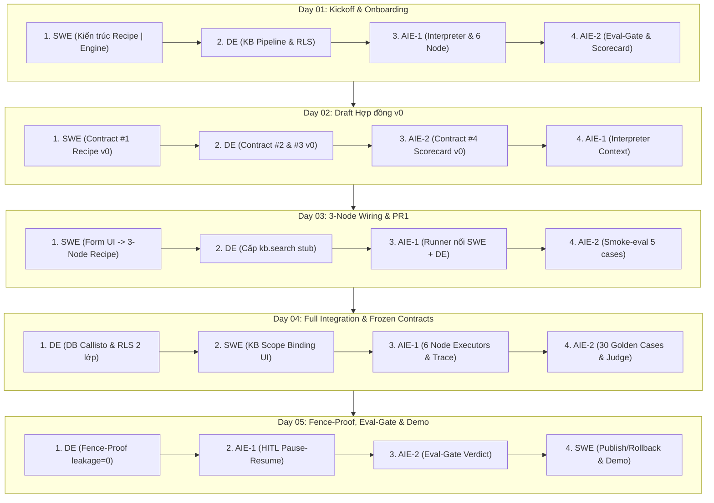

# 🧭 HƯỚNG DẪN THỨ TỰ ĐỌC TÀI LIỆU KNOWLEDGE SYSTEM (READING GUIDE)

Để hiểu trọn vẹn dự án **AgentCore Studio** mà không bị ngợp hoặc rối kiến trúc, bạn cần có **Chiến lược đọc tài liệu (Reading Strategy)** đúng đắn.

Tài liệu trong thư viện `Knowledge` được thiết kế theo mô hình 4 Quadrant (4 vị trí kỹ sư) đan xen phối hợp theo từng ngày làm việc (Day 01 đến Day 05).

---

## 💡 1. NÊN ĐỌC NHƯ THẾ NÀO? (CÂU TRẢ LỜI NHANH)

> **CÂU TRẢ LỜI**: **NÊN ĐỌC THEO TỪNG NGÀY (DAY-BY-DAY) VÀ THEO ĐÚNG THỨ TỰ THÀNH VIÊN ĐƯỢC CHỈ ĐỊNH CHO TỪNG NGÀY!**

❌ **KHÔNG NÊN**: Đọc hết 5 ngày của 1 bạn rồi mới chuyển sang bạn khác. (Vì các mảng kỹ thuật phụ thuộc lẫn nhau theo từng ngày, đọc 1 bạn sẽ bị hỏng ngữ cảnh phối hợp).  
❌ **KHÔNG NÊN**: Đọc ngẫu nhiên không có thứ tự.  
✅ **NÊN**: Đọc theo lộ trình **Day-by-Day (Từ Day 01 đến Day 05)**, trong mỗi ngày tuân theo thứ tự luồng dữ liệu (Data & Control Flow).

---

## 🎯 2. LỘ TRÌNH ĐỌC CHI TIẾT THEO TỪNG NGÀY (RECOMMENDED DAY-BY-DAY ORDER)

---

### 📅 DAY 01: Kickoff, Onboarding & Kiến trúc Nền tảng
- **Mục tiêu**: Nắm được ranh giới toàn bộ hệ thống và nhiệm vụ của 4 mảng.
- **Thứ tự đọc chuẩn**:
  1. 🥇 [**SWE (Thiệu Quang Minh)**](file:///c:/Users/thuym/Desktop/Today/VSF/docs/Knowledge/SWE_ThieuQuangMinh/Day01/README.md): Đọc trước tiên để hiểu ranh giới **Engine | Recipe Boundary** (Tư duy kiến trúc hệ thống).
  2. 🥈 [**DE (Nguyễn Đông Anh)**](file:///c:/Users/thuym/Desktop/Today/VSF/docs/Knowledge/DE_NguyenDongAnh/Day01/README.md): Đọc để hiểu hạ tầng tri thức Callisto và cơ chế bảo mật Postgres RLS.
  3. 🥉 [**AIE-1 (Trần Bá Đạt)**](file:///c:/Users/thuym/Desktop/Today/VSF/docs/Knowledge/AIE1_TranBaDat/Day01/README.md): Đọc để hiểu bộ máy thực thi lõi Interpreter loop và 6 loại Node đóng.
  4. 🏅 [**AIE-2 (Lưu Tiến Duy)**](file:///c:/Users/thuym/Desktop/Today/VSF/docs/Knowledge/AIE2_LuuTienDuy/Day01/README.md): Đọc để hiểu cổng kiểm định chất lượng Eval-Gate.

---

### 📅 DAY 02: Dự thảo 4 Hợp đồng Schema v0 & Scaffolding
- **Mục tiêu**: Hiểu cấu trúc Hợp đồng giao tiếp (Contracts) giữa các mảng.
- **Thứ tự đọc chuẩn**:
  1. 🥇 [**SWE**](file:///c:/Users/thuym/Desktop/Today/VSF/docs/Knowledge/SWE_ThieuQuangMinh/Day02/README.md): Giữ bút **Contract #1 (`recipe`)** — Cấu trúc AgentConfig và Recipe DAG.
  2. 🥈 [**DE**](file:///c:/Users/thuym/Desktop/Today/VSF/docs/Knowledge/DE_NguyenDongAnh/Day02/README.md): Giữ bút **Contract #2 (`kb.search`)** & **Contract #3 (`trace-event`)**.
  3. 🥉 [**AIE-2**](file:///c:/Users/thuym/Desktop/Today/VSF/docs/Knowledge/AIE2_LuuTienDuy/Day02/README.md): Giữ bút **Contract #4 (`scorecard`)** & 5 câu smoke test.
  4. 🏅 [**AIE-1**](file:///c:/Users/thuym/Desktop/Today/VSF/docs/Knowledge/AIE1_TranBaDat/Day02/README.md): Đọc cách Interpreter tiêu thụ các Hợp đồng trên thông qua `ExecutionContext` & VCR Fixtures.

---

### 📅 DAY 03: 3-Node DAG Wiring & PR Đầu Tiên (Walking Skeleton)
- **Mục tiêu**: Thấu hiểu luồng xâu kim 4 mảng hoạt động thông suốt lần đầu tiên.
- **Thứ tự đọc chuẩn**:
  1. 🥇 [**SWE**](file:///c:/Users/thuym/Desktop/Today/VSF/docs/Knowledge/SWE_ThieuQuangMinh/Day03/README.md): Tạo Form UI và sinh Recipe 3-Node JSON (`kb-retrieve` -> `llm-step` -> `end`).
  2. 🥈 [**DE**](file:///c:/Users/thuym/Desktop/Today/VSF/docs/Knowledge/DE_NguyenDongAnh/Day03/README.md): Cấp chữ ký rỗng `kb.search` stub signature cho AIE-1 import.
  3. 🥉 [**AIE-1**](file:///c:/Users/thuym/Desktop/Today/VSF/docs/Knowledge/AIE1_TranBaDat/Day03/README.md): Viết Interpreter runner nối Recipe của SWE với Stub của DE.
  4. 🏅 [**AIE-2**](file:///c:/Users/thuym/Desktop/Today/VSF/docs/Knowledge/AIE2_LuuTienDuy/Day03/README.md): Dựng Smoke-eval runner chấm điểm kết quả từ Interpreter.

---

### 📅 DAY 04: Full Integration, Database RLS & Frozen Contracts v1
- **Mục tiêu**: Hiểu cách hệ thống chuyển sang dùng dữ liệu thật và đóng băng Hợp đồng Schema v1.
- **Thứ tự đọc chuẩn**:
  1. 🥇 [**DE**](file:///c:/Users/thuym/Desktop/Today/VSF/docs/Knowledge/DE_NguyenDongAnh/Day04/README.md): Nạp 5 doc Callisto vào DB Postgres có bật RLS 2 lớp (`tenant_id` + `section_role`).
  2. 🥈 [**SWE**](file:///c:/Users/thuym/Desktop/Today/VSF/docs/Knowledge/SWE_ThieuQuangMinh/Day04/README.md): Tích hợp KB Scope Binding UI và bảo mật bức tường **INV-1 Tenant-Wall**.
  3. 🥉 [**AIE-1**](file:///c:/Users/thuym/Desktop/Today/VSF/docs/Knowledge/AIE1_TranBaDat/Day04/README.md): Cài đặt đủ 6 Node Executors và phát sự kiện `TraceEvent` tới Trace Sink.
  4. 🏅 [**AIE-2**](file:///c:/Users/thuym/Desktop/Today/VSF/docs/Knowledge/AIE2_LuuTienDuy/Day04/README.md): Dựng bộ 30 Golden Cases và cài đặt mô hình LLM-as-a-Judge.

---

### 📅 DAY 05: Fence-Proof Validation, Eval-Gate Verdict & Demo Sprint 1
- **Mục tiêu**: Nắm trọn luồng kiểm định chất lượng, bảo mật và xuất bản sản phẩm Agent.
- **Thứ tự đọc chuẩn**:
  1. 🥇 [**DE**](file:///c:/Users/thuym/Desktop/Today/VSF/docs/Knowledge/DE_NguyenDongAnh/Day05/README.md): Kiểm thử bảo mật Fence-Proof (`leakage = 0`) và tính toán `cost_usd`.
  2. 🥈 [**AIE-1**](file:///c:/Users/thuym/Desktop/Today/VSF/docs/Knowledge/AIE1_TranBaDat/Day05/README.md): Kiểm thử máy trạng thái HITL Pause-Resume checkpoint.
  3. 🥉 [**AIE-2**](file:///c:/Users/thuym/Desktop/Today/VSF/docs/Knowledge/AIE2_LuuTienDuy/Day05/README.md): Chạy 30 Golden Cases và đưa ra phán quyết Eval-Gate Verdict (PASS/FAIL).
  4. 🏅 [**SWE**](file:///c:/Users/thuym/Desktop/Today/VSF/docs/Knowledge/SWE_ThieuQuangMinh/Day05/README.md): Đấu nối nút Publish với Eval-Gate (PASS ➔ Publish, FAIL ➔ Rollback) và Demo 8 bước.

---

## 📌 3. TÓM TẮT 3 PHƯƠNG PHÁP ĐỌC TÙY THEO MỤC TIÊU CỦA BẠN

| Mục tiêu của người đọc | Phương pháp đọc khuyến nghị | Thứ tự thực hiện |
|---|---|---|
| **Người mới / Mentor / Leader** | **Đọc theo Luồng Tích hợp (Integration Flow)** | Tuân theo đúng **Lộ trình Day-by-Day** ở Phần 2. |
| **Thành viên đảm nhận 1 Vị trí** | **Đọc theo Chuyên môn (Deep-Dive Role)** | Chọn 1 bạn (vd: `SWE`) và đọc trọn vẹn từ Day 01 ➔ Day 05 của bạn đó. |
| **Kỹ sư Kiến trúc (System Architect)** | **Đọc theo Hợp đồng Schema (Contract-First)** | Đọc file `OVERVIEW_WORKFLOW.md` ➔ Các file `BAI_GIANG_CHI_TIET.md` phần Hợp đồng ở Day 02 & Day 04 của 4 bạn. |

---

## 🚀 LỜI KHUYÊN KHI ĐỌC MỖI NGÀY
Trong mỗi thư mục ngày của từng bạn (ví dụ `DE_NguyenDongAnh/Day02/`):
1. Đọc file **`README.md`** trước để nắm bức tranh tổng quan của ngày.
2. Đọc file **`BAI_GIANG_CHI_TIET.md`** để nắm vững kiến thức lý thuyết, sơ đồ và cạm bẫy kỹ thuật.
3. Đọc file **`MO_TA_NHIEM_VU.md`** để xem cách triển khai code thực tế, tiêu chuẩn DoD và comment báo cáo Issue GitHub.
