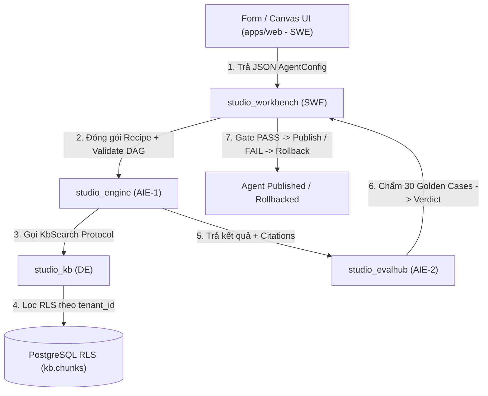

# TỔNG QUAN HỆ THỐNG AGENTCORE STUDIO & QUY TRÌNH PHỐI HỢP

## 1. GIỚI THIỆU DỰ ÁN
**AgentCore Studio** là một Mini-Studio cho phép 4 kỹ sư OJT (DE, SWE, AIE-1, AIE-2) cùng Mentor xây dựng một hệ thống khởi tạo, kiểm thử và phát hành các AI Agent end-to-end theo các tiêu chuẩn kỹ thuật hàng đầu.

Vòng đời 8 bước của AgentCore Studio:
1. **Form tạo Agent** (SWE — Workbench)
2. **Gắn Tool & KB Scope** (SWE — Workbench)
3. **Vẽ đồ thị Canvas DAG 6 node** (SWE — Web UI & Workbench)
4. **Test & Trace Timeline** với token/cost (AIE-1 — Engine & DE — KB Trace Sink)
5. **Fence-Proof Validation**: Kiểm tra chống rò rỉ dữ liệu tenant (`leakage = 0`) thông qua hàng rào PostgreSQL RLS (DE — KB)
6. **Eval 30-Case Golden Set**: Chấm điểm tự động qua Eval Hub, gate PASS mới cho phép Publish (AIE-2 — Evalhub & SWE — Workbench)
7. **Degrade & Rollback**: Tự động chặn và rollback phiên bản nếu đánh giá không đạt (AIE-2 & SWE)
8. **HITL-Pause**: Tạm dừng và tiếp tục chạy agent khi có phê duyệt từ con người (AIE-1 — Engine)

---

## 2. BẢNG PHÂN CÔNG VAI TRÒ & PHÂN QUYỀN (ROSTER & PERMISSIONS)

| Thành viên | GitHub Account | Package / Submodule Sở Hữu | Vai Trò & Nhiệm Vụ Chính |
|---|---|---|---|
| **SWE — Thiệu Quang Minh (BẠN)** | `Dozyboy` | `packages/workbench` `apps/web` | **Sở hữu Workbench UI & Recipe Architecture**: • Form UI & Canvas React Flow. • Recipe Schema (Contract #1). • Graph Validator (`graph_lint`). • Publish / Rollback & Tenant-Wall (`INV-1`). |
| **DE — Nguyễn Đông Anh** | `DongAnh2704` | `packages/kb` | **Sở hữu KB Pipeline & Security Data RLS**: • Chunking, Embedding, Indexing. • Query `kb.search` qua PostgreSQL RLS. • Trace Sink & Cost Table. • Giữ bút Contract #2 (`kb.search`) & Contract #3 (`trace-event`). |
| **AIE-1 — Trần Bá Đạt** | `TranBaDat2607` | `packages/engine` | **Sở hữu Engine & Interpreter (Stateless)**: • Interpreter execution loop duyệt DAG. • 6 Node Executors (`kb-retrieve`, `llm-step`, `tool-call`, `hitl-pause`,...). • Fixtures VCR cho LLM step. |
| **AIE-2 — Lưu Tiến Duy** | `dholmes0207` | `packages/evalhub` | **Sở hữu Evaluation & Scoring Harness**: • Eval Harness 30 golden cases. • LLM-Judge & Agreement check. • Scorecard compute/render (Contract #4). |
| **Mentor (Anh Hiếu)** | `hieubui2409` | `packages/contracts` `apps/studio` `(repo cha)` | **Architect & Lead**: • Cung cấp infra (Postgres RLS, Docker, OTel, Queue). • Phê duyệt thay đổi hợp đồng frozen Pydantic contracts. • Quản lý Composition Root (`apps/studio`). |
| **Antigravity AI (Tôi)** | — | — | **Trợ lý AI Pair Programmer**: • Hỗ trợ bạn (SWE) và team lập trình, giải thích kiến trúc. • Hướng dẫn TDD, refactor code, kiểm tra tiêu chuẩn DoD. |

---

## 3. LUỒNG CHẠY TÍCH HỢP (INTEGRATION FLOW)

---

## 4. CẤU TRÚC THƯ MỤC THƯ VIỆN KNOWLEDGE (DAY DẠNG THƯ MỤC)
Mỗi ngày của từng thành viên đã được đưa vào một **Thư mục (Directory) riêng** (`Day01/`, `Day02/`, `Day03/`, `Day04/`, `Day05/`) chứa file `README.md` và sẵn sàng mở rộng thêm tài liệu/code mẫu cho từng ngày:

- `SWE_ThieuQuangMinh/`
  - `Day01/README.md`
  - `Day02/README.md`
  - `Day03/README.md`
  - `Day04/README.md`
  - `Day05/README.md`
- `DE_NguyenDongAnh/`
  - `Day01/README.md`
  - `Day02/README.md`
  - `Day03/README.md`
  - `Day04/README.md`
  - `Day05/README.md`
- `AIE1_TranBaDat/`
  - `Day01/README.md`
  - `Day02/README.md`
  - `Day03/README.md`
  - `Day04/README.md`
  - `Day05/README.md`
- `AIE2_LuuTienDuy/`
  - `Day01/README.md`
  - `Day02/README.md`
  - `Day03/README.md`
  - `Day04/README.md`
  - `Day05/README.md`
