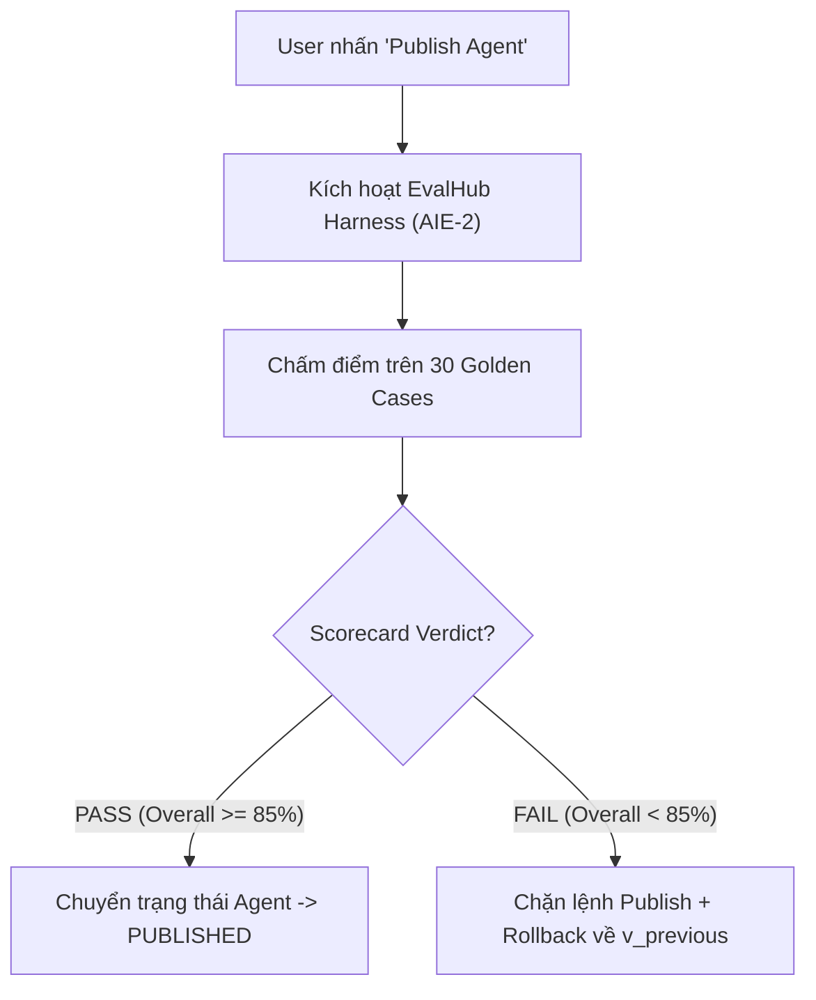

# 📖 BÀI GIẢNG CHI TIẾT DAY 05 — SWE: EVAL-GATE WIRING, PUBLISH / ROLLBACK & CANVAS UI

> **Vị trí phụ trách**: Software Engineer (SWE — Thiệu Quang Minh)  
> **Chủ đề chính**: Đấu nối Eval-Gate, Luồng Publish / Rollback tự động, React Flow Canvas UI và Demo Sprint 1  
> **Mục tiêu**: Xây dựng chốt chặn cuối cùng kiểm soát việc phát hành Agent, chỉ cho phép xuất bản khi Agent vượt qua bài đánh giá tự động trên 30 Golden Cases.

---

## 🚪 1. KIẾN TRÚC PUBLISH FLOW VÀ EVAL-GATE WIRING

Cổng đánh giá (Eval-Gate) là trái tim kiểm soát chất lượng trong AgentCore Studio:



### Mã giả luồng Publish Flow (`publish_manager.py`):
```python
async def publish_agent(agent_id: str, recipe: RecipeDAG) -> PublishResult:
    # 1. Gọi EvalHub chạy bộ kiểm thử 30 câu
    scorecard = await evalhub.run_eval_suite(agent_id, recipe)
    
    # 2. Kiểm tra ngưỡng chất lượng
    if scorecard.pass_gate and scorecard.overall_score >= 0.85:
        # Lưu phiên bản mới
        save_active_version(agent_id, recipe)
        return PublishResult(status="PUBLISHED", message="Xuất bản thành công!")
    else:
        # Rollback phiên bản cũ
        rollback_to_previous_version(agent_id)
        return PublishResult(
            status="ROLLBACKED", 
            message=f"Publish bị chặn do Scorecard không đạt: {scorecard.overall_score * 100}%"
        )
```

---

## 🎨 2. REACT FLOW CANVAS UI & TRẠNG THÁI CHỈNH SỬA

Giao diện kéo thả Canvas UI trên React Flow (`apps/web`):
- Các Node được represented dưới dạng React Flow Custom Nodes.
- Khi kết nối 2 node (Edge Creation), UI tự động cập nhật trường `next_node` trong Recipe JSON.
- Nút "Validate Graph" hiển thị kết quả kiểm tra `graph_lint` theo thời gian thực (real-time error badges).

---

## 🏁 3. QUY TRÌNH DEMO & RETROSPECTIVE SPRINT 1 (SWE LEAD)

SWE dẫn dắt buổi Demo 8 bước trọn vòng đời tác giả Agent:
1. Trình bày Form / Canvas tác giả Agent.
2. Cho xem Recipe JSON được sinh tự động.
3. Kích hoạt lệnh Publish $\rightarrow$ Thấy Eval-Gate chạy đánh giá $\rightarrow$ Đưa ra kết quả PASS / ROLLBACK trực quan trên UI.
